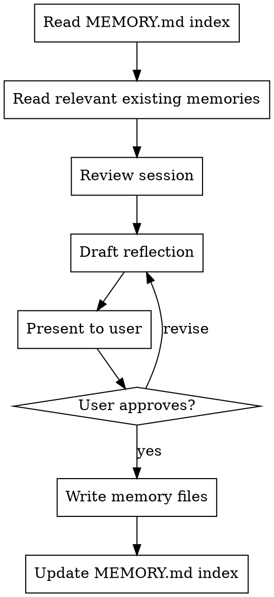

# Retrospective

Structured end-of-cycle reflection that captures learnings into user-scoped memory.

## When to Use

- After `finishing-a-development-branch` completes
- When user explicitly runs `/retro`
- After a significant debugging session or design revision
- NOT mid-implementation — wait until a natural stopping point

## Process

### Step 1: Gather Context

- Read `~/.claude/memory/MEMORY.md` index
- Read any existing memories that relate to this session's work
- Review the current session: what was designed, implemented, reviewed, and what issues arose

### Step 2: Draft Reflection

Present to user in this format:

**Session Summary** (2-3 lines)

**What went well**
- Bullet points

**What went wrong**
- Bullet points

**Proposed memory updates:**

| Action | Category | File | Summary |
|---|---|---|---|
| Create | mistake | `missed-X.md` | Brief description |
| Update | pattern | `existing.md` | What changed |
| Delete | skill-gap | `old-gap.md` | Why removing |

**Feedback for you:**
- Prompt quality observations (what worked, what could be clearer)
- Skill observations (areas improving, areas to focus on)
- Pattern confirmations (approaches worth repeating)

### Step 3: User Review

- Present the full reflection and wait for approval
- User may adjust, reject items, or add their own observations
- Do NOT write any files until user approves

### Step 4: Write Memories

- Create/update/delete memory files per approved plan
- Use templates from `~/.claude/rules/memory.md`
- Update `MEMORY.md` index with new entries
- Verify MEMORY.md stays under 100 lines

## Rules

- Never write memories without user approval during /retro
- Frame skill gaps constructively — "Claude should proactively cover X" not "user is bad at X"
- Be specific and actionable — vague memories are useless
- Check for duplicates — update existing memories rather than creating new ones
- One retro per development cycle — don't over-capture
